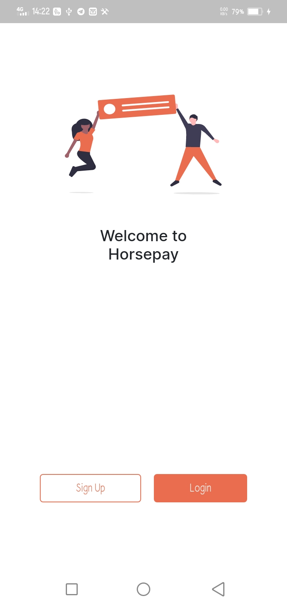
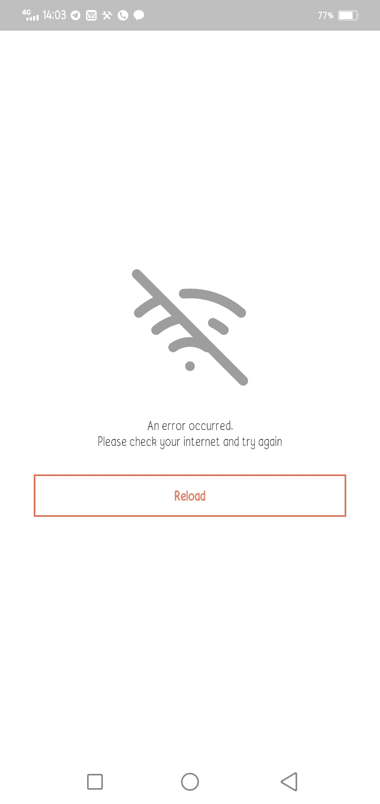
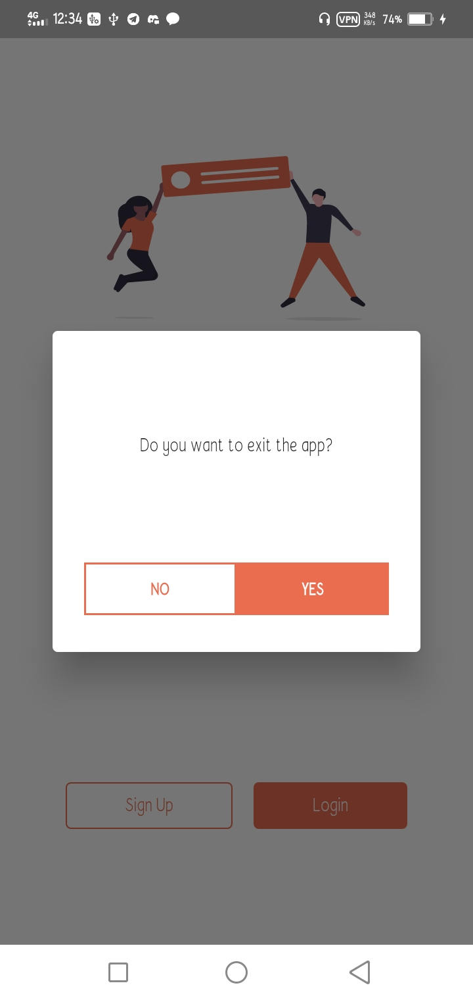

# HorsePay

HorsePay is a mobile app that leverages on the webview_flutter package to display a payment platform.

##What concepts are embedded within? 

- Loading Screen:
  A loading screen displays before once the user launches the app. This screen only goes away when the webview is done loading.
- BackPress handling:
  When the user presses the back button on any part of the app, if the webview is able to go back, the user is navigated to the previous screen. Otherwise, the user is asked to confirm app exit.
- Proper error management:
  The app displays an error page each time the user is not connected. The error page has a clear error message and a refresh button which allows the user refresh the page. Once the refresh button is pressed, the page reloads and if the user is connected, progress is restored.

**Screenshots**

